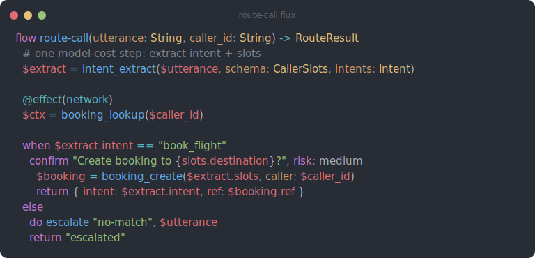

# flux-tree-sitter

A [tree-sitter](https://tree-sitter.github.io/tree-sitter/) grammar for
**Flux-Lang** (`.flux`) — the human-writable text form of a
[flux](https://github.com/codewandler/flux) execution graph.

Tree-sitter is what powers syntax highlighting in **Helix**, **Neovim**, and
**Zed** — none of which read TextMate grammars — and it is the route to
GitHub/Linguist code-view highlighting. This is the tree-sitter counterpart to
[`codewandler/flux-editors`](https://github.com/codewandler/flux-editors), which
ships the TextMate grammar and IntelliJ plugin.

> **Naming.** The package (npm / crate) is **`flux-tree-sitter`**. The tree-sitter
> *language* is **`flux`** — so the generated C entrypoint is `tree_sitter_flux()`
> and the parser name you reference in Helix/Neovim is `flux`. That is the
> language name, not the project name; it does not change.
>
> **Setting up your editor with an agent?** Point it at
> [`AGENTS.md`](AGENTS.md) — it has copy-pasteable, idempotent setup steps.

## Example

<!-- assets/example.svg is a generated image (GitHub can't highlight .flux) — regenerate with `flux render`, see AGENTS.md. -->


<sub>[`examples/readme-example.flux`](examples/readme-example.flux), rendered by `flux render` — the canonical One-Dark highlighting this grammar mirrors.</sub>

## What it highlights

The grammar recognises the full editor-facing surface as a tolerant superset: current runtime
syntax is parsed precisely, while documented legacy/aspirational authoring forms remain coloured
instead of collapsing into `ERROR` nodes. Semantic validation still belongs to `flux-lsp` and the
Flux compiler.

- **Declarations** — `flow`, `op`, `agent`, `channel`, `datasource`, `trigger`,
  `journey`, `type` (records + `|` unions)
- **Statements** — typed binds and context appends; `do`; conditions and loops; match/route;
  fallback/parallel/race; seq/block/pipe; retry/timeout/budget; `ctx`; assertions and verification;
  confirm/throttle/debounce; try/catch; memo/once/checkpoint/await; scope/finally; saga/step/undo;
  `return`, `with_tools`, and `goal`
- **Expressions** — dotted/kebab op calls (`babelforce-manager.acd.create_queue`),
  strict/optional `$var.field?` access, `peek`, `thing`, inline `@json`, named arguments,
  multiline object/array/call layouts, `fmt(...)`, and `parse(...)`
- **Literals** — ordinary and verbatim `"""triple"""` strings, `{name}`/`{{name}}`
  interpolation, literal braces, underscored numbers, booleans, and `null`
- **Annotations** — `@effect(...)`, generic thing annotations, and `@json <compact-json>` (with
  JSON injected into the escape via `injections.scm`)
- `secret "ENV"` references, comments

### Highlight roles and themes

Highlighting is semantic rather than catalog-driven. Every callable name — `now`, `fmt`, `parse`,
`ai.extract`, a plugin op, or a module-local composite op — is captured as `@function`; whether an
operation exists is an LSP/compiler concern. Runtime symbols such as `$result` are captured as the
portable `@variable` scope, and parameters as `@variable.parameter`.

The active editor theme maps those scopes to colours. For example, Helix's Monokai Pro Spectrum
deliberately renders `@variable` as white; the grammar does not misclassify symbols to force a hue.
Use Helix's `:tree-sitter-highlight-name` command to inspect the scope under the cursor. The README
image shows the canonical Flux renderer's target palette; capture-level Rust tests verify that the
tree-sitter query follows the same role contract.

## Design — line-oriented, not indentation-tracked

Flux is indentation-structured, but a full `INDENT`/`DEDENT` external scanner is a
classic source of subtle bugs (multi-level dedent, comment lines, multi-line
`"""` strings). This grammar deliberately avoids that:

- Top-level **declarations own their body** — the run of statements/attributes up
  to the next top-level keyword — so declarations fold and scope correctly.
- Bodies are **flat within a declaration**: a `when` header and the lines beneath
  it are siblings. The grammar tracks no indentation depth.
- The **one** indentation fact it needs — telling an indented body line
  (`agent triage` inside a `trigger`) apart from a new top-level declaration
  (`agent foo` at column 0) — comes from a tiny external scanner
  ([`src/scanner.c`](src/scanner.c)): a single zero-width `_line_start` token that
  fires only at column 0. No indent stack, no state.

The result is robust for **highlighting** — it does not ERROR on real files — at
the cost of not modelling every nesting level, mirroring the upstream
TextMate/IntelliJ tooling. Deep block nesting (fine-grained folding of each
`when`/`each` body, block-scoped locals) would be a future full-indentation
scanner.

## Install in an editor

### Helix

The recommended installer registers an immutable grammar revision, fetches/builds only Flux,
installs the matching queries, preserves existing Flux/LSP configuration, and runs
`hx --health flux`:

```sh
curl --proto '=https' --tlsv1.2 -LsSf \
  https://raw.githubusercontent.com/codewandler/flux-tree-sitter/main/scripts/install-helix.sh | bash
```

Run the same command again to update. Restart Helix after an install or update. For `flux-lsp`
diagnostics, completion, hover, and formatting, follow the canonical
[Flux editor setup guide](https://codewandler.github.io/flux/docs/language/editors).

<details>
<summary>Manual installation and troubleshooting</summary>

Helix treats `rev` as a checkout target. Resolve the moving branch once and put the resulting
immutable commit—not `main`—in `~/.config/helix/languages.toml`:

```sh
git ls-remote https://github.com/codewandler/flux-tree-sitter refs/heads/main
```

```toml
[[language]]
name = "flux"
scope = "source.flux"
file-types = ["flux"]
comment-token = "#"
indent = { tab-width = 2, unit = "  " }

[[grammar]]
name = "flux"
source = { git = "https://github.com/codewandler/flux-tree-sitter", rev = "<40-character commit>" }
```

Temporarily put `use-grammars = { only = ["flux"] }` before all tables while running the build;
otherwise Helix fetches its entire built-in grammar catalog. Preserve any selection you already
had once the build is done. Then:

```sh
hx --grammar fetch
hx --grammar build
mkdir -p ~/.config/helix/runtime/queries/flux
cp ~/.config/helix/runtime/grammars/sources/flux/queries/*.scm \
  ~/.config/helix/runtime/queries/flux/
hx --health flux
```

The parser and queries are a matched set; update and copy both together. `--health` checks their
presence, not their revision or colours. Use `:tree-sitter-highlight-name` on a token to inspect its
semantic capture; the active Helix theme chooses the visible colour.

</details>

> Helix highlights via tree-sitter only — it does **not** render LSP semantic
> tokens (as of 25.07). Colour comes entirely from this grammar +
> `highlights.scm`; a flux LSP contributes diagnostics/hover/completion, not
> token colours.

### Neovim (nvim-treesitter)

```lua
local parser_config = require("nvim-treesitter.parsers").get_parser_configs()
parser_config.flux = {
  install_info = {
    url = "https://github.com/codewandler/flux-tree-sitter",
    files = { "src/parser.c", "src/scanner.c" },
    branch = "main",
  },
  filetype = "flux",
}
vim.filetype.add({ extension = { flux = "flux" } })
```

Then `:TSInstall flux` and copy `queries/*.scm` into `queries/flux/` on your
runtimepath. (Unlike Helix, Neovim *can* also apply LSP semantic tokens on top.)

## Develop

```sh
npm install                 # dev deps (the tree-sitter CLI)
npx tree-sitter generate    # regenerate src/ from grammar.js
npx tree-sitter test        # run the corpus tests in test/corpus/
npx tree-sitter parse examples/contact-centre.flux     # inspect a parse tree
npx tree-sitter highlight examples/contact-centre.flux # needs a theme in ~/.config/tree-sitter/config.json
```

Bindings are provided for **Node** and **Rust** (standard tree-sitter
boilerplate). The C parser + external scanner are compiled and exercised by
`tree-sitter test`. See [`AGENTS.md`](AGENTS.md) for the contributor/agent
workflow and invariants.

## Status

Verified in CI: `tree-sitter generate` is conflict-free and `src/` is in sync; the current-surface
and baseline corpus tests pass; every bundled example parses with **zero** ERROR/MISSING nodes; all
three query files compile against the examples; and Rust tests assert the exact highlight captures
for generic callables, symbols, parameters, keys, types, interpolation, and recovery.

## License

Dual-licensed under [MIT](LICENSE-MIT) or [Apache-2.0](LICENSE-APACHE), matching
the flux projects.
